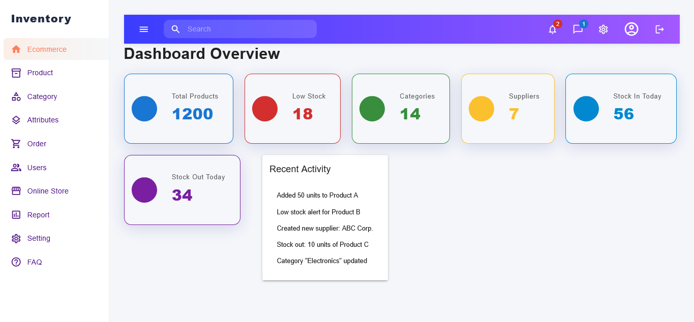
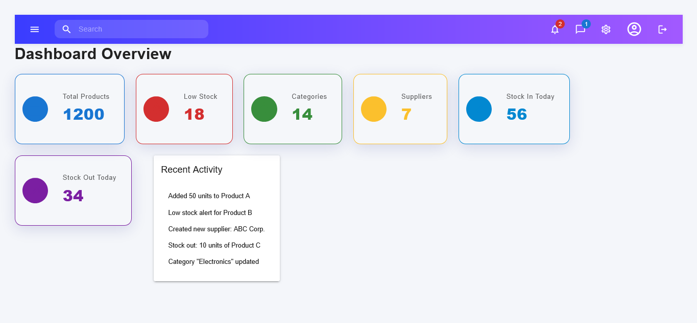

# 📊 Inventory & Sales Dashboard

A **modern, responsive inventory and sales management dashboard** built with **React 19**, **TypeScript**, **Material UI v7**, and **Vite**. Designed for usability, flexibility, and performance in managing inventory, customers, suppliers, and sales data.

---
## 🖼️ Screenshots



## ✨ Features

* **📋 Dashboard Overview:**
  Visual summary of products, stock, categories, suppliers, and recent activity.

* **📦 Product Management:**
  Add, view, and manage products and categories.

* **📉 Stock Tracking:**
  Monitor stock levels, get low stock alerts, and track stock movements.

* **👥 Supplier & Customer Management:**
  Easily manage suppliers and customers.

* **💰 Sales & Purchases:**
  Track sales and purchase records with ease.

* **📈 Reports:**
  Generate and view essential business reports.

* **🔐 User Management:**
  Manage user accounts, roles, and permissions.

* **⚙️ Settings:**
  Configure application preferences.

* **📱 Responsive UI:**
  Built with Material UI and custom components for an intuitive experience on all devices.

---

## 📂 Project Structure

```
src/
  App.tsx                      # Main app with routing
  components/
    Sidebar.tsx                # Navigation sidebar
    Topbar.tsx                 # Top navigation bar
    DashboardSummaryCard.tsx   # Dashboard stat cards
  pages/
    DashboardPage.tsx          # Main dashboard overview
    SettingsPage.tsx           # App settings
  modules/
    products/ProductsPage.tsx
    categories/CategoriesPage.tsx
    stock/StockPage.tsx
    suppliers/SuppliersPage.tsx
    customers/CustomersPage.tsx
    sales/SalesPage.tsx
    purchases/PurchasesPage.tsx
    reports/ReportsPage.tsx
    users/UsersPage.tsx
```

---

## 🛠 Tech Stack

* ⚛ **React 19** + **TypeScript**
* 🎨 **Material UI v7** for rich UI components
* ⚡ **Vite** for lightning-fast builds and dev experience
* 📊 **Recharts** *(planned)* for analytics and charting
* 🧭 **React Router v7** for seamless navigation

---

## 🚀 Getting Started

```bash
# 1. Install dependencies
npm install

# 2. Start the development server
npm run dev

# 3. Build for production
npm run build
```

---

## 🔧 Customization

* Update navigation items in `src/components/Sidebar.tsx`
* Configure routes in `src/App.tsx`
* Create new modules inside `src/modules/` to extend features

---

### 📌 Dashboard Overview


### 📦 Product Management


### 📉 Stock Tracking


---

## 📄 License

This project is licensed under the [MIT License](LICENSE).

---

Let me know if you'd like a Markdown file generated or help with uploading screenshots or adding a GitHub Pages preview.
